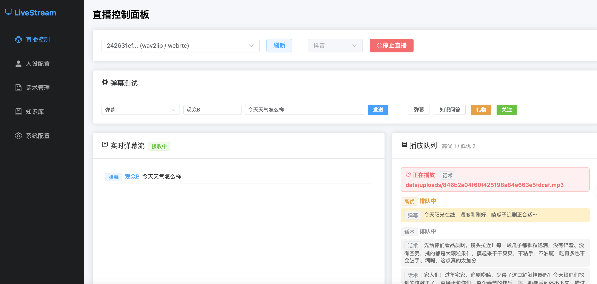

基于LiveTaking的数字人直播工具  

根据添加的话术循环播放，中间能够插入弹幕回复。支持根据知识库回答问题  
  

## 后端
```bash
git clone https://github.com/lipku/LiveStream.git 
cd LiveStream
conda create -n livestream python=3.12
conda activate livestream
cd backend 
pip install -r requirements.txt
python app/main.py
```

## 前端 (Web)
cd frontend && npm run build

## 运行
1. 运行[LiveTalking](https://github.com/lipku/livetalking)服务  
浏览器打开http://livetalking-server:8010/index.html  连接视频
    > 如果livetalking以虚拟摄像头输出模式（--transport virtualcam）启动，则不需要打开页面连接视频 
2. 浏览器打开http://127.0.0.1:8020   
在系统设置项里配置livetalking服务器地址，大模型的apikey  
在话术管理项里添加需要播放的带货话术，支持文字和音频文件。   
在直播控制项里选择livetalking sessionid和直播平台，点击开始直播。  
3. 用obs或直播伴侣抓屏或者采集虚拟摄像头推送数字人画面

## 弹幕抓取工具  
抖音  https://github.com/ape-byte/DouyinBarrageGrab  
视频号 https://github.com/fire4nt/wxlivespy

